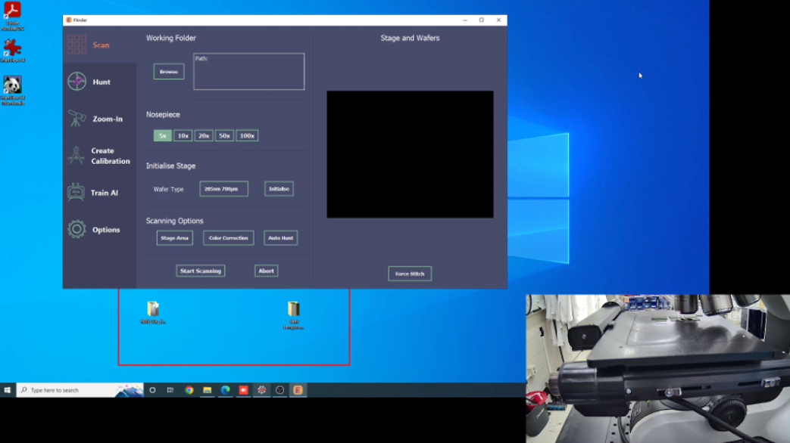

# Flinder

This is an updated version of [Flinder](https://github.com/ClementCollignon/Flinder).
It relies on pymmcore for controling the microscope.

### Requirements

## How to use?

Have a look at the [demo](demo.mkv)

